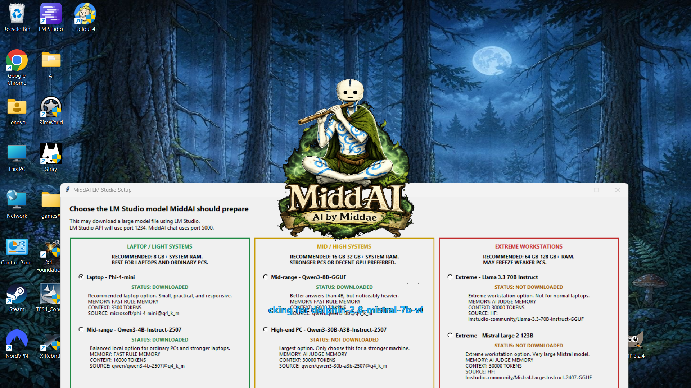

# MiddAI Private, Offline AI from Middae
MiddAI is built for people who want the privacy and control of a local AI, without losing the powerful features that make cloud AI useful.

 
 # [Download MiddAI](https://github.com/Middae/MiddAI---Private-Offline-AI-from-Middae/releases/download/v2.0/MiddAI.V2.0.zip) Click here to download MiddAI.

  

Offline AI. Online intelligence when you need it.
MiddAI is a self-hosted AI assistant that runs on your own computer. It can work fully offline, but when connected to the internet it can search the web, check facts, and use results to improve its answers.

## **Features:**

**Offline Use**  
Once LM Studio and a model are installed, MiddAI can chat locally without an internet connection.

**Online Search**  
When connected to the internet, MiddAI can search the web for current information, sources, and image results.

**Image Search**  
Search results can include image thumbnails, useful for places, objects, plants, products, and visual examples.

**Memory System**  
MiddAI includes a local memory system with short-term, mid-term, and long-term memory. Memories are stored locally and can be deleted by the user.

**Assistants**  
Choose between built-in assistant profiles or create your own custom assistant with its own instructions, personality, and greeting.

**File Analysis**  
Attach supported text documents or files and ask MiddAI to summarize, explain, rewrite, or answer questions from them.

**Image Analysis**  
With an image-analysis model selected, MiddAI can inspect attached images and screenshots, then answer questions about what is visible.

**Self-Hosted Setup**  
MiddAI helps guide users through model selection and loading, making local AI easier to use without needing to manually configure everything.

## **Screenshots**

  

  

  

  

## **Privacy:**

MiddAI is designed to run locally on your own computer. Your chats, memory, settings, assistants, and instruction files are stored on your machine, inside:  `Documents\MiddAI`

MiddAI does not collect, upload, sell, or share your personal data. There is no central MiddAI server holding your chat history or memory.

If you delete your chats, memory, custom assistants, settings, or the `Documents\MiddAI` folder, that data is removed from your device.

The only times MiddAI needs internet access are:

- downloading models through LM Studio
- using Search mode to fetch web results
- loading image search results when you ask for them

Local chat can run without an internet connection once LM Studio and a model are installed.

## **Easy Setup:**

Getting started with MiddAI is simple:

1. Download the latest MiddAI release from GitHub.
2. Extract the downloaded ZIP file.
3. Run `MiddAI_Setup.exe`.
4. Install LM Studio if you do not already have it.
5. Open LM Studio once so it can finish its first-time setup.
6. Launch MiddAI.

On first launch, MiddAI will prepare its setup files, download the selected AI model, and start the local server.

Your settings, AI instructions, and memory file are saved locally in:

C:\Users\YourName\Documents\MiddAI

## **Free to Download:**
MiddAI is free to download and use.

Because it runs locally on your own computer, there are no cloud usage fees or subscription costs. The only cost is the processing power and electricity used by your own device while the AI is running.

MiddAI supports multiple AI model options for different types of hardware. You can choose a smaller model for lower-end laptops, or a larger model if you have a more powerful PC.

For example, my own laptop runs the lowest model with a shorter context length, using around 3 GB of RAM.

This means you do not need a high-end gaming PC to try MiddAI, although stronger hardware will allow larger models, longer memory/context, and better performance.

## **Models:** 

Laptop: Phi-4-mini, fast rules memory, 6,000 context, approx. 2.49 GB

Low-end: Qwen3-4B-Instruct-2507, AI Judge memory, 30,000 context, approx. 2.50 GB

Low-end: Gemma 3 4B, AI Judge memory, 28,000 context, approx. 3.0 GB

Low-end: Ministral 3 3B, AI Judge memory, 28,000 context, image-capable testing, approx. 2.0 GB

Mid-range: Mistral 7B Instruct v0.3, AI Judge memory, 30,000 context, approx. 4.37 GB

Mid-range: Mistral NeMo 12B, AI Judge memory, 30,000 context, approx. 6.90 GB

High-end: Qwen3-30B-A3B-Instruct-2507, AI Judge memory, 70,000 context, approx. 18.56 GB

Image Analysis: Ministral 3 3B Reasoning, AI Judge memory, 28,000 context, approx. 2.0 GB

Image Analysis: Qwen2.5-VL-7B, AI Judge memory, 16,000 context, approx. 5.37 GB

Image Analysis: Qwen2.5-VL-32B, AI Judge memory, 30,000 context, approx. 18.5 GB

Extreme: Llama 3.3 70B Instruct, AI Judge memory, 120,000 context, approx. 42.5 GB

Extreme: Mistral Large 2 123B, AI Judge memory, 120,000 context, approx. 73.3 GB

Advanced: Custom loaded LM Studio model, uses whatever model the user already has loaded in LM Studio

## **System Requirements:**

MiddAI requires Windows, LM Studio, and enough free storage for whichever model you choose to download. The program itself is lightweight; the selected model is what determines RAM use, storage size, and speed.

### Low / Laptop

Recommended for basic local chat, light search, and smaller models.

Suggested:

- Windows 10/11
- 8 GB+ RAM
- 10 GB+ free storage
- CPU-only is fine
- Best for smaller models and lower-end laptops

### Medium

Recommended for better local chat, search, memory, file analysis, and lighter image analysis.

Suggested:

- Windows 10/11
- 16 GB-32 GB RAM
- 25 GB+ free storage
- Dedicated GPU preferred but not required
- Best for stronger laptops, gaming PCs, and ordinary desktop PCs

### High / Workstation

Recommended for large models, long context, heavy image analysis, and stronger reasoning.

Suggested:

- Windows 10/11
- 64 GB-128 GB+ RAM
- 100 GB+ free storage
- Strong GPU, high VRAM, or unified memory setup strongly recommended
- Best for workstation-class machines

Extreme models are protected by a warning step. The user must type UNDERSTOOD before downloading them, so they cannot be selected accidentally.
